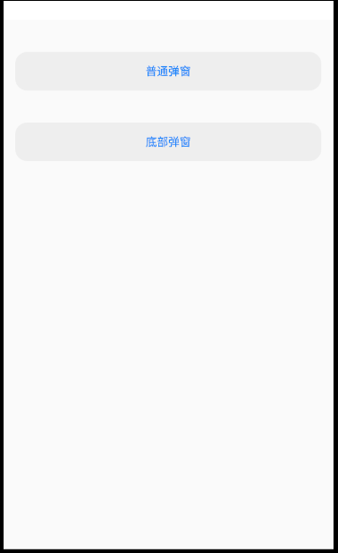

## 仿IOS制作的一套Android组件

[](https://opensource.org/licenses/MIT)  [](https://bintray.com/civitasv/iosLike/dialog/_latestVersion)

### 1. Dialog

使用方式：
```java
implementation 'com.civitasv.iosLike:dialog:0.1.2'
```
#### 1.1 普通弹窗

**使用方式**：

```java
new DialogNormal(this)
        .setTitle("标题", new DialogTextStyle.Builder()
                .color(getResources().getColor(R.color.ios_like_red))
                .textSize(18)
                .typeface(Typeface.create(Typeface.MONOSPACE, Typeface.BOLD_ITALIC)).build())
        .setContent("内容", content -> {
            Toast.makeText(this, "点击内容", Toast.LENGTH_LONG).show();
        })
        .setCanceledOnTouchOutside(false)
        .show();
````

**效果**：


#### 1.2 底部弹窗

**使用方式**：

```java
DialogBottom dialogBottoms;
dialogBottoms = new DialogBottom(this)
        .setTitle("这张照片将从所有设备上的\"iCloud照片\"中删除。")
        .addBottomItem("删除照片")
        .addBottomItem("添加照片")
        .addBottomItem("点击事件", v1 -> dialogBottoms.dismiss())
        .addBottomItem("颜色样式", new DialogTextStyle.Builder()
                .color(getResources().getColor(R.color.ios_like_red))
                .textSize(18)
                .typeface(Typeface.create(Typeface.MONOSPACE, Typeface.BOLD_ITALIC)).build());
dialogBottoms.show();
```

**效果**：




