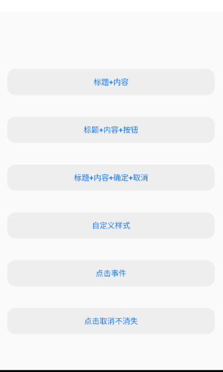

## 仿IOS制作的一套Android组件

[](https://opensource.org/licenses/MIT)  [](https://bintray.com/civitasv/iosLike/dialog/_latestVersion)

### 1. Dialog

使用方式：
```java
implementation 'com.civitasv.iosLike:dialog:0.1'
```
#### 1.1 普通弹窗

```java
new DialogNormal(this)
        .setCancel("取消")
        .setConfirm("确定")
        .setTitle("标题")
        .setContent("内容")
        .setCanceledOnTouchOutside(false)
        .show();
````

**效果**：




