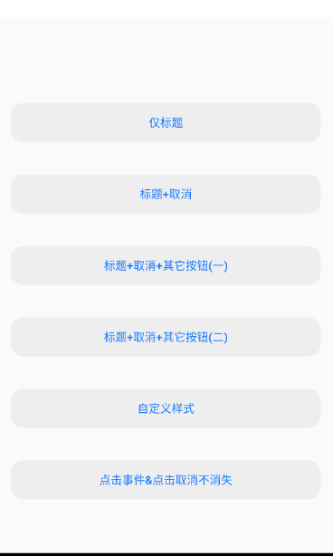

## 仿IOS制作的一套Android组件

[](https://opensource.org/licenses/MIT)  [](https://bintray.com/civitasv/iosLike/dialog/_latestVersion)

### 1. Dialog

使用方式：
```java
implementation 'com.civitasv.iosLike:dialog:0.1.3'
```
#### 1.1 普通弹窗

**使用方式**：

```java
new DialogNormal(this)
        .setTitle("标题")
        .setTitleClickListener(v2 -> {
            Toast.makeText(this, "点击标题", Toast.LENGTH_SHORT).show();
        })
        .setContent("内容", v2 -> {
            Toast.makeText(this, "点击内容", Toast.LENGTH_SHORT).show();
        })
        .setConfirm("确定", v2 -> {
            Toast.makeText(this, "点击确定", Toast.LENGTH_SHORT).show();
        })
        .setCancel("取消", v2 -> {
            Toast.makeText(this, "点击取消", Toast.LENGTH_SHORT).show();
        }, false)
        .setCancelStyle(new DialogTextStyle.Builder(this).color(R.color.ios_like_green).typeface(Typeface.create(Typeface.MONOSPACE, Typeface.BOLD_ITALIC)).build())
        .setConfirmStyle(new DialogTextStyle.Builder(this).color(R.color.ios_like_purple).typeface(Typeface.create(Typeface.SANS_SERIF, Typeface.ITALIC)).build())
        .setCanceledOnTouchOutside(true)
        .show();
````

详细使用见demo [DialogNormalActivity](app/src/main/java/com/civitasv/ioslike/DialogNormalActivity.java).

**效果**：


#### 1.2 底部弹窗

**使用方式**：

```java
new DialogBottom(this)
        .setTitle("标题", v2 -> {
            Toast.makeText(this, "点击标题", Toast.LENGTH_SHORT).show();
        })
        .setCancel("取消", v2 -> {
            Toast.makeText(this, "点击取消", Toast.LENGTH_SHORT).show();
        }, false)
        .setCancelStyle(new DialogTextStyle.Builder(this).color(R.color.ios_like_green).typeface(Typeface.create(Typeface.MONOSPACE, Typeface.BOLD_ITALIC)).build())
        .addBottomItem("按钮1", v2 -> Toast.makeText(this, "点击按钮1", Toast.LENGTH_SHORT).show(), new DialogTextStyle.Builder(this).color(R.color.ios_like_pink).typeface(Typeface.create(Typeface.MONOSPACE, Typeface.BOLD_ITALIC)).build())
        .addBottomItem("按钮2", new DialogTextStyle.Builder(this).color(R.color.ios_like_purple).textSize(20).typeface(Typeface.create(Typeface.MONOSPACE, Typeface.BOLD_ITALIC)).build())
        .setCanceledOnTouchOutside(true)
        .show();
```

详细使用见demo [DialogBottomActivity](app/src/main/java/com/civitasv/ioslike/DialogBottomActivity.java).

**效果**：



#### 1.3 hud弹窗

**使用方式**:

```java
new DialogHud(this)
        .setMode(DialogHud.Mode.LOADING)
        .setLabel("Please wait...")
        .setLabelDetail("downloading...")
        .setCanceledOnTouchOutside(true)
        .setAutomaticDisappear(true)
        .show();
```

详细使用见demo [DialogHudActivity](app/src/main/java/com/civitasv/ioslike/DialogHudActivity.java).

**效果**:


